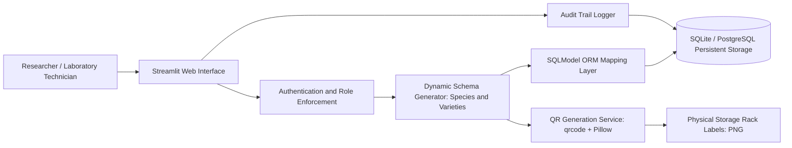

# laboratory-inventory-manager

Hierarchical specimen tracking, dynamic schema management, and QR-indexed container management system for biological and tissue culture laboratories.

## Overview

Laboratory Inventory Manager is a web application engineered for research and tissue culture laboratories to track biological specimens hierarchically (Species, Varieties, Racks, and Vials). It enables researchers to define dynamic, per-species JSON metadata schemas, generate deep-linked QR asset labels for physical storage racks, and maintain verifiable database audit trails through an intuitive Streamlit interface.

## Architecture and Pipeline

The application manages biological hierarchy and physical rack labeling through a modular database and presentation pipeline.



- Hierarchical Modeling: Structures biological specimens across nested levels (`Species` -> `Variety` -> `Rack`), supporting custom schema fields per species.
- Dynamic Schema Compilation: Metadata definitions (e.g. growth medium, pH, hormone concentrations, incubation dates) are validated against dynamically compiled JSON schemas.
- Physical QR Routing: Generates deep-linked QR codes (`?type=rack&id=...`) for instant smartphone or barcode scanner retrieval of rack provenance and parameters.
- Persistence Layer: Built on SQLModel (combining SQLAlchemy 2.0 and Pydantic) supporting local zero-setup SQLite or cloud-hosted PostgreSQL instances.
- Audit Logging: Captures create, update, and deletion operations with UTC timestamps in dedicated audit log tables.

## Tech Stack

| Component | Technology | Description |
| :--- | :--- | :--- |
| Runtime | Python 3.10+ | Primary language environment |
| Frontend / Presentation | Streamlit 1.30+ | Multi-page laboratory application dashboard |
| ORM / Validation | SQLModel, SQLAlchemy, Pydantic | Typed database entities and schema enforcement |
| Database Engine | SQLite (default) / PostgreSQL | Relational storage for biological assets |
| Asset Generation | qrcode (PIL), Pillow | Deep-linked QR label rendering and image processing |
| Data Processing | Pandas | Tabular data export and inventory summaries |

## Project Structure

```text
tissue-lab-inv-manager/
├── .env.example              # Environment variables template
├── .gitignore                # Git exclusion patterns
├── README.md                 # Technical documentation
├── system_analysis.md        # Architectural review and schema specifications
├── main.py                   # Main dashboard and QR routing entrypoint
├── populate.py               # Test database seeding utility
├── requirements.txt          # Python dependencies
├── modules/                  # Application core modules
│   ├── auth.py               # Administrative session controls
│   ├── database.py           # SQLModel engine initialization and migrations
│   ├── models.py             # Entity models (Species, Variety, Rack, AuditLog)
│   └── qr_utils.py           # QR rendering and byte serialization
└── pages/                    # Multi-page Streamlit views
    ├── 1_Species_&_Varieties.py # Taxon and variety management
    ├── 2_Racks_&_Containers.py  # Physical rack and batch management
    └── 3_Audit_Logs.py          # Operational audit trail inspector
```

## Setup and Prerequisites

### Prerequisites
- Python 3.10 or higher
- Modern web browser for Streamlit interaction

### Installation

1. Clone the repository:
   ```bash
   git clone https://github.com/Gehrman-Sparrow42/tissue-lab-inv-manager.git
   cd tissue-lab-inv-manager
   ```

2. Initialize virtual environment:
   ```bash
   python -m venv .venv
   .venv\Scripts\activate
   ```

3. Install dependencies:
   ```bash
   pip install -r requirements.txt
   ```

4. Configure environment:
   ```bash
   copy .env.example .env
   ```

5. (Optional) Seed sample laboratory records:
   ```bash
   python populate.py
   ```

## Usage Examples

### Launching the Laboratory Dashboard
```bash
streamlit run main.py
```
Open your browser at `http://localhost:8501`.

### Environment Configuration

| Variable | Default Value | Description |
| :--- | :--- | :--- |
| `DB_PATH` | `data/inventory_v2.db` | SQLite path or PostgreSQL connection URI |
| `ADMIN_PASSWORD` | `admin` | Password for administrative modification modes |

## Notes and Constraints

- Dynamic Attributes: Species-level metadata schemas are stored as JSON strings. Validating deeply nested schema changes on existing racks requires re-saving the parent variety.
- QR Physical Labeling: Generated QR labels are exported as 300x300 PNG files formatted for standard label printers.
- Concurrency: For multi-user concurrent lab environments, configure `DB_PATH` to a hosted PostgreSQL instance rather than local SQLite.
