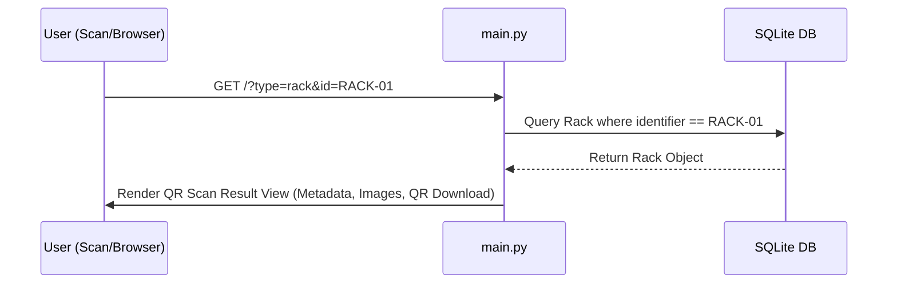

# ETAE Laboratory Inventory - System Analysis Report

This report provides an in-depth structural review of the ETAE Laboratory Inventory Management system. It details the current architectural state, database schemas, dynamic form mechanics, QR generation pipelines, and potential improvement angles for future scaling.

---

## 1. Executive Summary
The ETAE Inventory system is a single-server, lightweight Web application built with **Streamlit** and **SQLModel** (built on top of SQLAlchemy and Pydantic). It is designed to manage laboratory biological subjects hierarchically (Species ➔ Varieties ➔ Racks) and track physical containers via deep-linked QR labels.

Following recent improvements, the system is fully operational with zero-leak file tracking, type-safe metadata validations, and comprehensive audit logs.

---

## 2. Technical Stack & Architecture

```
┌────────────────────────────────────────────────────────┐
│                   STREAMLIT FRONTEND                   │
│  (main.py / 1_Species_&_Varieties.py / 2_Racks_etc.)   │
└───────────────────────────┬────────────────────────────┘
                            │ Queries & Commits
                            ▼
┌────────────────────────────────────────────────────────┐
│                   SQLMODEL / SQLALCHEMY                │
│         (modules/models.py & modules/database.py)      │
└───────────────────────────┬────────────────────────────┘
                            │ SQLite Driver
                            ▼
┌────────────────────────────────────────────────────────┐
│                      SQLITE DB FILE                    │
│                  (data/inventory.db)                   │
└────────────────────────────────────────────────────────┘
```

* **Core Platform**: Python 3, Streamlit (UI rendering & state machine).
* **Database Driver**: SQLite (file-based).
* **ORM Layer**: SQLModel (declarative schemas, type-safety, mapping compilation).
* **Assets**: PNG (QR labels generated dynamically via `qrcode`) and JPEG (uploaded rack assets optimized using `PIL`).

---

## 3. Database Schema & Data Models

The database schema contains four tables. Unused SQLAlchemy relationships have been simplified to resolve mapping conflicts during Streamlit hot-reloading.

### 3.1. Entity Tables & Fields

#### `Species`
Represents the base biological category. Defines the custom metadata schema that all descendants must implement.
* `id` (Primary Key, integer)
* `name` (String, unique, indexed) - e.g., *Solanum tuberosum*
* `description` (String, optional)
* `metadata_schema` (JSON String) - e.g., `[{"name": "pH", "type": "number", "default": 5.5}]`
* `qr_code_path` (String) - Path to QR image file.
* `created_at` (DateTime, UTC timezone)

#### `Variety`
Represents a sub-breed or strain of a specific Species.
* `id` (Primary Key, integer)
* `name` (String, indexed) - e.g., *Everest*
* `species_id` (Foreign Key ➔ `species.id`)
* `description` (String, optional)
* `qr_code_path` (String)
* `created_at` (DateTime, UTC timezone)

#### `Rack`
Represents a physical container housing a specific Variety. Holds the actual key-value metadata records.
* `id` (Primary Key, integer)
* `rack_identifier` (String, unique, indexed) - e.g., *RACK-POT-001*
* `variety_id` (Foreign Key ➔ `variety.id`)
* `image_url` (String, optional) - Path to uploaded container image.
* `qr_code_path` (String)
* `metadata_json` (JSON String) - Map of key-value values (e.g., `{"pH": 6.20}`).
* `created_at` (DateTime, UTC timezone)

#### `AuditLog`
Tracks administrative operations for security audits.
* `id` (Primary Key, integer)
* `action` (String) - `CREATE`, `UPDATE`, `DELETE`
* `table_name` (String) - Target entity table.
* `record_id` (Integer) - ID of affected record.
* `timestamp` (DateTime, UTC timezone)
* `details` (String) - Textual details (e.g., `"Edited: RACK-POT-001"`).

---

## 4. Control Flows & Subsystems

### 4.1. The QR Code & Deep Linking Pipeline
The app generates deep links pointing to the base address with query parameters: `BASE_URL/?type={entity}&id={id}`.
When a user scans a physical label:
1. `main.py` intercepts `st.query_params` during application load.
2. If `type` and `id` are present, it bypasses the dashboard page.
3. It fetches the matching record (e.g., `Rack` by its identifier) and displays a clean metadata card containing the entity's QR, image, and properties.
4. Users can click a "Back" button to return to the standard dashboard.



### 4.2. Schema Validation Pipeline
To prevent database corruption and layout-crashing exceptions on the Rack inventory rendering page, the Species metadata schema inputs are validated against a strict structure:
1. **JSON Parser Check**: Verify the schema string is a valid JSON array.
2. **Key Checks**: Ensure each element is a dictionary containing a non-empty `"name"` field.
3. **Type Checks**: Verify that `"type"` values are restricted to either `"text"` or `"number"`.

```python
def validate_metadata_schema(schema_str: str):
    schema = json.loads(schema_str)
    if not isinstance(schema, list):
        raise ValueError("Schema must be a JSON array (list).")
    for item in schema:
        if not isinstance(item, dict):
            raise ValueError("Each schema item must be an object (dictionary).")
        if "name" not in item or not item["name"].strip():
            raise ValueError("Each schema item must contain a non-empty 'name' field.")
        if "type" in item and item["type"] not in ["text", "number"]:
            raise ValueError("Schema item 'type' must be 'text' or 'number'.")
    return schema
```

### 4.3. Interactive UX & Rerun Toast Mechanics
Streamlit re-runs scripts top-to-bottom on any state change (inputs, clicks). Success popups (e.g., `st.success()`) will vanish instantly if followed immediately by `st.rerun()`. 

To provide persistent feedback:
1. Operations write messages to `st.session_state.toast_message`.
2. The script calls `st.rerun()`.
3. During page initialization, a global listener intercepts `toast_message`, renders it via `st.toast()`, and deletes the key to prevent loops.

---

## 5. Security & Isolation Controls

* **Global Access Checks**: Sidebar elements and critical mutation forms are wrapped inside `is_admin()` decorators checking `st.session_state.is_admin`.
* **Sidebar Hiding**: Unused menu headers, the Streamlit deploy button, and three-dot options menu are hidden via global CSS injection to keep a clean, local application interface.
* **Stop Server Hook**: A sidebar utility allows terminating the process directly (`os._exit(0)`), avoiding orphaned process leaks.

---

## 6. Possible Improvement Angles

### 6.1. Technical Enhancements
* **Database Migrations (Alembic)**: If the tables change (e.g., adding user accounts, locations, or notes), Alembic will be needed to handle schema changes gracefully.
* **Transaction Safety**: Context managers (`with Session(engine) as session:`) should replace global session hooks to prevent open connections during long-running Streamlit processes.
* **Metadata Schema Re-Validation**: Currently, changing a Species' metadata schema doesn't check if descendant Racks have existing data mismatching the new schema. Implementing a schema migration wizard would prevent data format corruption.

### 6.2. Administrative UI Features
* **Audit Log Export**: Allow exporting the Audit Log history to a CSV or Excel sheet.
* **Backup Scheduling**: Automate backups of `inventory.db` to a separate folder or backup bucket daily.
* **Bulk QR Packaging**: Create a layout tool to compile and export all QR codes to a printable PDF sheet (e.g., a grid of labels).
* **Role-Based Accounts**: Expand `auth.py` from a single static admin password to supporting multiple user roles (e.g., "Guest" (Read-only), "Technician" (Log inputs), "Admin" (Alter configurations)).
